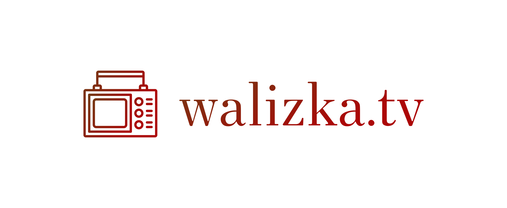

# Logotyp walizka.tv
+ [Landing page: www.walizka.tv](https://www.walizka.tv/)
+ [Dokumentacja](https://docs.walizka.tv/)
+ [Logo.walizka.tv](https://logo.walizka.tv/)

## Font

        Font in use <a target="_blank" href="https://hanken.co/product/hk-venetian/">HKVenetian-Regular</a> designed by
        <a target="_blank" href="https://hanken.co/">Hanken Design Co.</a>
        and licensed under
        <a target="_blank" href="http://scripts.sil.org/cms/scripts/page.php?site_id=nrsi&amp;id=OFL_web">Open Font License.</a>
          Icon Designed by
          <a target="_blank" href="https://thenounproject.com/berkahicon">Berkah Icon</a>

## Font
  
    #733A14, #AC0707

## Background

    transparent

## Icon
     
    #733A14, #AC0707
    
    
## logo

## 1

## 2

